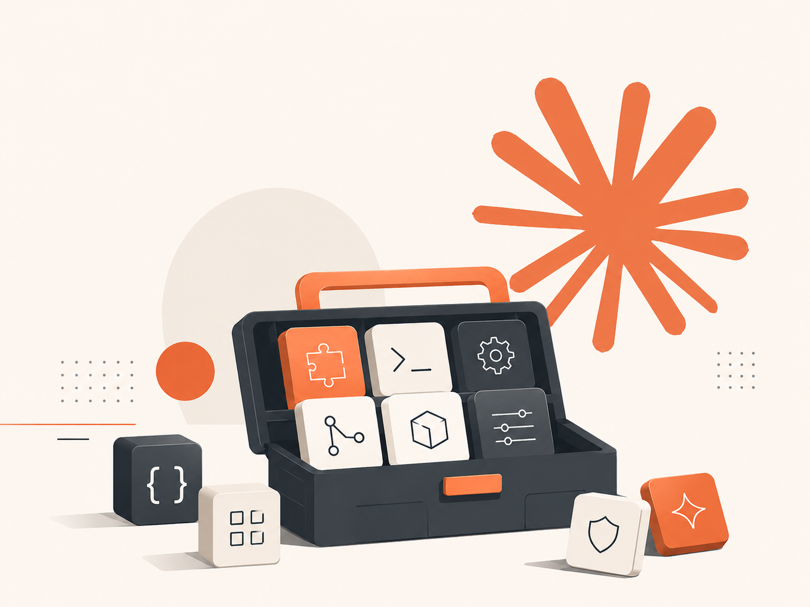

<div align="center">
  
</div>

<br />

My personal collection of [Claude Code](https://docs.claude.com/en/docs/claude-code) extensions, distributed as a [shadcn GitHub registry](https://ui.shadcn.com/docs/registry/github).

Items install into the **current project** under `.claude/`, so run the install command from your project root. (shadcn writes into the project you run it in — its `~` means "project root", not your home directory — so a skill lands in `<project>/.claude/skills/<name>/`.)

## Install

Install any item with the shadcn CLI:

```bash
npx shadcn@latest add KhaledSaeed18/dotclaude/<item>
```

For example, run this from your project root and the `handoff` skill lands in `.claude/skills/handoff/`:

```bash
npx shadcn@latest add KhaledSaeed18/dotclaude/handoff
```

Want a skill available globally (in every project)? so install it into a project as above and copy it across:

```bash
cp -R .claude/skills/handoff ~/.claude/skills/
```

## Catalog

The table below is generated from each skill's `SKILL.md` — run `pnpm gen` after adding or editing a skill.

<!-- skills:start -->

### Engineering

| Skill | Description | Install |
| --- | --- | --- |
| [explain-codebase](skills/engineering/explain-codebase/) | Onboard to an unfamiliar codebase by mapping its architecture, entry points, and data flow. Use when starting work in a new or unknown repository and you need a navigable mental model fast. | `npx shadcn@latest add KhaledSaeed18/dotclaude/explain-codebase` |

### Productivity

| Skill | Description | Install |
| --- | --- | --- |
| [handoff](skills/productivity/handoff/) | Compact the current conversation into a handoff document for another agent to pick up. | `npx shadcn@latest add KhaledSaeed18/dotclaude/handoff` |
| [pr-description](skills/productivity/pr-description/) | Generate a clear, reviewer-friendly pull-request description from a diff — covering what changed, why, risk, and how it was tested. Use when opening a pull request or writing/improving a PR body. | `npx shadcn@latest add KhaledSaeed18/dotclaude/pr-description` |

### Security

| Skill | Description | Install |
| --- | --- | --- |
| [dependency-audit](skills/security/dependency-audit/) | Audit a project's dependencies for outdated and vulnerable packages and surface breaking-change notes for upgrades. Works with any ecosystem — npm/pnpm/yarn, pip/Poetry/uv, Cargo, Go modules, Maven/Gradle, Bundler, Composer, and others. | `npx shadcn@latest add KhaledSaeed18/dotclaude/dependency-audit` |
| [secret-scan](skills/security/secret-scan/) | Scan code or a diff for hardcoded secrets — API keys, tokens, passwords, private keys, and other exposed credentials — before they get committed or shipped. Use before committing, during review, or when auditing a repository. | `npx shadcn@latest add KhaledSaeed18/dotclaude/secret-scan` |

<!-- skills:end -->

## Adding a skill

Create `skills/<category>/<name>/SKILL.md`, then run `pnpm gen` (regenerates the registry files and this catalog) and `pnpm validate`.

The **category is the folder** the skill lives in (e.g. `skills/security/secret-scan/`) — that's the single source of truth, so there's no field to set in the manifest, and the catalog above groups skills by it automatically. Recategorising a skill is a `git mv` into another category folder. Skills always install to a flat `.claude/skills/<name>/`, so the category organises this repo only — it never appears in the install path.

## How it works

The single source of truth for each item is its folder location (`skills/<category>/<name>/`) plus the manifest's frontmatter. `scripts/gen.ts` derives the shadcn registry files (`registry.json` at the root and one per item, with the folder's category recorded in each item's `categories`) and the catalog above; `scripts/validate.ts` checks the manifests and layout, then delegates structural checks to `shadcn registry validate`. CI runs both on every pull request.

## License

[MIT](LICENSE) © Khaled Saeed
