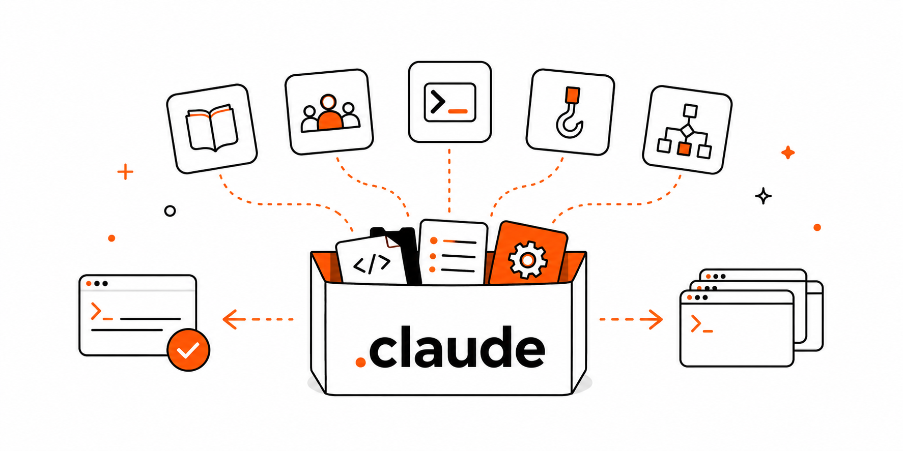

<div align="center">
  
</div>

<div align="center">
  <a href="https://docs.claude.com/en/docs/claude-code"></a>
</div>

<div align="center">
  <a href="#as-claude-code-plugins-recommended"></a>
  <a href="#with-the-shadcn-cli-single-items"></a>
</div>

<div align="center">
<!-- badges:start -->
  <a href="#skills"></a>
  <a href="#agents"></a>
  <a href="#commands"></a>
  <a href="#hooks"></a>
  <a href="#as-claude-code-plugins-recommended"></a>
<!-- badges:end -->
</div>

<div align="center">
  <a href="https://github.com/KhaledSaeed18/dotclaude/actions/workflows/validate.yml"></a>
  <a href="https://github.com/KhaledSaeed18/dotclaude/actions/workflows/security.yml"></a>
  <a href="https://github.com/KhaledSaeed18/dotclaude/stargazers"></a>
  <a href="LICENSE"></a>
  <a href="https://github.com/KhaledSaeed18/dotclaude"></a>
</div>

<br />

<div align="center">
  <strong>Browse, search, and filter the catalog at <a href="https://dotclaude.khaledsaeed.tech">dotclaude.khaledsaeed.tech</a>.</strong>
</div>

<br />

My personal collection of [Claude Code](https://docs.claude.com/en/docs/claude-code) extensions, distributed as a [shadcn GitHub registry](https://ui.shadcn.com/docs/registry/github).

Items install into the **current project** under `.claude/`, so run the install command from your project root. (shadcn writes into the project you run it in; its `~` means "project root", not your home directory, so a skill lands in `<project>/.claude/skills/<name>/`.)

## Skills, agents, commands, and hooks

If you are new to Claude Code extensions, here is what each kind is and when you would reach for it. They differ mainly in **who or what sets them off**.

- **Skill.** A reusable procedure Claude loads on its own when your request matches what the skill is for. You do not have to ask for it by name. Reach for a skill when you keep repeating the same multi-step task and want Claude to just know how to do it well (for example, writing a good commit or scanning for leaked secrets).
- **Agent.** A specialist Claude can hand a whole side task to, working in its own separate context and handing back just the result. Reach for an agent when a job would otherwise flood the main conversation with noise, like deep web research or a focused code review.
- **Command.** A shortcut you trigger yourself by typing `/name`. Reach for a command when you want to kick something off deliberately, on your timing, rather than leaving it to Claude to decide.
- **Hook.** A script that runs automatically on an event in Claude Code, such as before a tool runs or when a session ends. Reach for a hook when you want something to happen every single time, with no model judgment involved, like logging or a safety check.

The table under [What installs where](#what-installs-where) shows where each one lands on disk and what triggers it.

## Install

There are two ways to get these items: **plugins** (bundles, managed by Claude Code, hooks pre-wired) or the **shadcn CLI** (one item at a time, copied into your project).

### As Claude Code plugins (recommended)

Add the marketplace once, then install any bundle:

```
/plugin marketplace add KhaledSaeed18/dotclaude
/plugin install security@dotclaude
```

A good starter set is **engineering + git + security-hooks** — the daily workflow skills, the branch lifecycle, and the deterministic guardrails. From a terminal you can install all three in one line (the CLI takes one plugin per call):

```bash
for p in engineering git security-hooks; do claude plugin install "$p@dotclaude"; done
```

Prefer browsing? After adding the marketplace, open `/plugin` and pick from the **Discover** tab — no typing needed.

Plugins update with the repo (`/plugin marketplace update dotclaude`), namespace their commands (`/security:security-audit`), and — unlike the shadcn route — **hook plugins activate immediately**, with no manual `settings.json` editing.

<!-- plugins:start -->

| Plugin | What you get | Install |
| --- | --- | --- |
| **engineering** | Engineering workflow skills and review agents: planning, test-driven development, systematic debugging, code review, completion verification, and performance work. (15 skills, 6 agents, 1 command) | `/plugin install engineering@dotclaude` |
| **security** | Security review toolkit: OWASP-aligned code review, dependency and secret auditing skills, a security-auditor agent, and a full-codebase /security-audit command. (3 skills, 1 agent, 1 command) | `/plugin install security@dotclaude` |
| **security-hooks** | Deterministic guardrails, active immediately after install: a compound-command deny list, sensitive-file protection, and prompt-injection screening. (3 hooks) | `/plugin install security-hooks@dotclaude` |
| **git** | Version-control skills for the whole branch lifecycle: committing, worktrees, merge conflicts, undo/recovery, PR descriptions, changelogs, releases, and branch cleanup. (9 skills, 1 command) | `/plugin install git@dotclaude` |
| **productivity** | Session productivity skills: collaborative brainstorming, plan stress-testing, session handoff documents, and a /prime command that loads project context. (5 skills, 2 commands) | `/plugin install productivity@dotclaude` |
| **testing** | Testing toolkit: browser-based end-to-end verification with Playwright and a /write-tests command that generates a suite matching project conventions. (2 skills, 1 command) | `/plugin install testing@dotclaude` |
| **research** | Investigation toolkit: a deep-research subagent for multi-source work with citations, plus name-clearing skills for software projects (registries, app stores) and for businesses (social handles, storefronts, company registers). (2 skills, 1 agent) | `/plugin install research@dotclaude` |
| **workflow-hooks** | Session workflow guardrails, active on install: a session-start situation report, a stop gate that runs the tests before Claude finishes, type errors fed back after each edit, git footgun protection, a branch-first nudge, and a subagent audit log. (6 hooks) | `/plugin install workflow-hooks@dotclaude` |
| **format-on-edit** | Automation hook that runs the project's own formatter (Biome, Prettier, gofmt, rustfmt, or ruff) on every file Claude edits, so changes land already formatted. (1 hook) | `/plugin install format-on-edit@dotclaude` |
| **notify** | Desktop notifications for Claude Code: surfaces permission requests and attention prompts as native macOS/Linux notifications so long sessions can run in the background. (1 hook) | `/plugin install notify@dotclaude` |
| **precompact-saver** | Context-preservation hook that snapshots the full session transcript before every compaction, keeping the newest ten snapshots per project. (1 hook) | `/plugin install precompact-saver@dotclaude` |
| **tool-call-logger** | Observability hook that appends one sanitized JSON line per tool call to a local log, with secret redaction and payload truncation. (1 hook) | `/plugin install tool-call-logger@dotclaude` |

<!-- plugins:end -->

The four `create-*` authoring skills are intentionally not in any plugin; they exist to author items for this repository and install via shadcn only.

### With the shadcn CLI (single items)

Install any single item with the shadcn CLI:

```bash
npx shadcn@latest add KhaledSaeed18/dotclaude/<item>
```

For example, run this from your project root and the `handoff` skill lands in `.claude/skills/handoff/`:

```bash
npx shadcn@latest add KhaledSaeed18/dotclaude/handoff
```

### What installs where

Each item installs under `.claude/`, by type:

| Type | Installs to | Triggered by |
| --- | --- | --- |
| Skills | `.claude/skills/<name>/` | Claude, automatically, when the description matches the task |
| Agents | `.claude/agents/<name>.md` | Claude delegating to the subagent, or you invoking it |
| Commands | `.claude/commands/<name>.md` | You, by typing `/<name>` |
| Hooks | `.claude/hooks/<name>/` | A `settings.json` event you wire up (see below) |

**Hooks need one extra step.** shadcn copies the hook's script and its `HOOK.md`, but it can't edit your `settings.json`. After installing a hook, open its `HOOK.md` and add the documented block to `.claude/settings.json` to activate it.

Want an item available globally (in every project)? Install it into a project as above and copy it into your home config — folders for skills and hooks, single files for agents and commands:

```bash
cp -R .claude/skills/handoff ~/.claude/skills/        # skills & hooks: folders
cp .claude/agents/code-reviewer.md ~/.claude/agents/  # agents & commands: single files
```

Skills and hooks that bundle companion files install them in the same folder, and the `cp -R` above carries them across automatically.

### Hook configuration

Hooks that take settings read one optional file, `<project>/.claude/dotclaude.json`, and fall back to sensible defaults when it is absent or unreadable. Each hook reads only its own key; a full example:

```json
{
  "gitGuard": { "protectedBranches": ["main", "master", "develop", "release/*"], "allowNoVerify": false },
  "branchProtect": { "protectedBranches": ["main", "master", "develop"] },
  "stopGate": { "command": "pnpm test", "timeoutMs": 120000, "onlyWhenDirty": true },
  "typecheckOnEdit": { "enabled": true, "maxLines": 25 },
  "sessionContext": { "commits": 3, "handoffFile": "HANDOFF.md" },
  "subagentSummary": { "logFile": ".claude/subagents.log" }
}
```

Each hook's `HOOK.md` documents its keys.

## Catalog

The catalog below lists every item in this repository, grouped by type and then category.

<!-- catalog:start -->

### Skills

#### Engineering

| Skill | Description | Install |
| --- | --- | --- |
| [adversarial-reviewer](skills/engineering/adversarial-reviewer/) | Review code through three hostile personas - the Saboteur, the New Hire, and the Security Auditor - each required to find at least one issue. Use when a standard review feels too comfortable, when code is going into a critical path, when a previous review missed bugs that later surfaced, or when you want coverage across correctness, clarity, and security in a single pass. | `npx shadcn@latest add KhaledSaeed18/dotclaude/adversarial-reviewer` |
| [api-design-review](skills/engineering/api-design-review/) | Review an API contract (REST or GraphQL) before or while it is implemented, checking resource naming, HTTP semantics, status codes, error shape, pagination, versioning, idempotency, and backward compatibility, and producing concrete revisions rather than abstract advice. Use when designing new endpoints, changing an existing API's surface, or reviewing a PR that adds or modifies API routes. | `npx shadcn@latest add KhaledSaeed18/dotclaude/api-design-review` |
| [code-review-response](skills/engineering/code-review-response/) | Process code-review feedback with technical rigour. Understand each point, check it against the actual codebase, and respond with reasoning or implementation rather than reflexive agreement. Use when you receive review comments (from a human, the code-reviewer agent, or any reviewer) and are about to act on them, especially if any feedback seems unclear or wrong. | `npx shadcn@latest add KhaledSaeed18/dotclaude/code-review-response` |
| [create-agent](skills/engineering/create-agent/) | Author a new subagent for this repository end to end by scaffolding it with pnpm new, curating its tool allowlist, setting model, color, and memory in frontmatter, then writing a focused system prompt and regenerating the registry. Use when creating, scaffolding, or reviewing an agent or subagent in this repo. | `npx shadcn@latest add KhaledSaeed18/dotclaude/create-agent` |
| [create-command](skills/engineering/create-command/) | Author a new slash command for this repository end to end by scaffolding it with pnpm new, writing the frontmatter and argument handling, drafting the prompt body, then regenerating the registry. Use when creating, scaffolding, or reviewing a slash command in this repo. | `npx shadcn@latest add KhaledSaeed18/dotclaude/create-command` |
| [create-hook](skills/engineering/create-hook/) | Author a new Claude Code hook for this repository end to end by scaffolding it with pnpm new, writing the hook script and its settings.json wiring, documenting activation in HOOK.md, then regenerating the registry. Use when creating, scaffolding, or reviewing a hook in this repo. | `npx shadcn@latest add KhaledSaeed18/dotclaude/create-hook` |
| [create-skill](skills/engineering/create-skill/) | Author a new skill for this repository end to end by choosing its category, writing trigger-friendly frontmatter, structuring the SKILL.md, splitting reference material into companion files, then regenerating the registry and README catalog. Use when creating, scaffolding, restructuring, or reviewing a skill in this repo. | `npx shadcn@latest add KhaledSaeed18/dotclaude/create-skill` |
| [db-migration-safety](skills/engineering/db-migration-safety/) | Review or write a database schema migration with production safety as the bar, checking locks, table rewrites, backfills, expand-contract deploy order, index creation, and rollback for Postgres, MySQL, and common ORMs. Use when adding or reviewing a migration, dropping or renaming columns, or adding constraints or indexes to large tables. | `npx shadcn@latest add KhaledSaeed18/dotclaude/db-migration-safety` |
| [executing-plans](skills/engineering/executing-plans/) | Execute a written implementation plan task by task, reviewing it critically first, following each step exactly, running every verification, and stopping to ask rather than guessing when blocked. Use when you have a plan document (such as one from the writing-plans skill) and need to implement it in this session. | `npx shadcn@latest add KhaledSaeed18/dotclaude/executing-plans` |
| [explain-codebase](skills/engineering/explain-codebase/) | Onboard to an unfamiliar codebase by mapping its architecture, entry points, and data flow. Use when starting work in a new or unknown repository and you need a navigable mental model fast. | `npx shadcn@latest add KhaledSaeed18/dotclaude/explain-codebase` |
| [fix-ci](skills/engineering/fix-ci/) | Diagnose and fix a failing CI run by pulling the actual failure logs (gh run view --log-failed), reproducing the failure locally, fixing the root cause rather than the symptom, and verifying green before and after pushing. Use when a GitHub Actions run is red, a PR check is failing, or CI passes locally but fails remotely. | `npx shadcn@latest add KhaledSaeed18/dotclaude/fix-ci` |
| [grill-with-docs](skills/engineering/grill-with-docs/) | Stress-test a plan against the project's existing domain model by challenging terminology, surfacing contradictions with code, and updating CONTEXT.md and ADRs inline as decisions crystallise. Use when a plan or design needs to be checked against the project's documented domain model before implementation. | `npx shadcn@latest add KhaledSaeed18/dotclaude/grill-with-docs` |
| [parallel-agents](skills/engineering/parallel-agents/) | Fan independent work out to multiple subagents that run concurrently, each with a focused scope and self-contained instructions, then review and integrate their results. Use when you face two or more genuinely independent tasks (separate failing test files, unrelated bugs, distinct subsystems) that share no state and don't depend on each other's order. | `npx shadcn@latest add KhaledSaeed18/dotclaude/parallel-agents` |
| [performance-optimization](skills/engineering/performance-optimization/) | Fix a performance problem by profiling first, making one targeted change, and verifying both the speedup and that correctness held. Use when a feature is measurably slow, a page or API exceeds its budget, or a query takes too long. Do not use to pre-optimize code that has not been measured. | `npx shadcn@latest add KhaledSaeed18/dotclaude/performance-optimization` |
| [solid-principles](skills/engineering/solid-principles/) | Apply the SOLID principles as design diagnostics, detecting god classes, fragile hierarchies, fat interfaces, and hard-wired dependencies, and prescribing the smallest structural fix rather than imposing ceremony. Use when designing a new module or class, reviewing object-oriented code, or untangling a class that keeps changing for unrelated reasons. | `npx shadcn@latest add KhaledSaeed18/dotclaude/solid-principles` |
| [systematic-debugging](skills/engineering/systematic-debugging/) | Debug a bug, test failure, crash, or unexpected behaviour by finding the root cause before changing anything, instead of guessing at fixes. Works in any language or stack. Use when something is broken, a test is failing, behaviour is wrong, or a previous fix didn't hold. | `npx shadcn@latest add KhaledSaeed18/dotclaude/systematic-debugging` |
| [test-driven-development](skills/engineering/test-driven-development/) | Implement a feature or bugfix test-first using the red-green-refactor cycle. Write a failing test, watch it fail, write the minimal code to pass, then clean up. Works in any language or test runner. Use when building new behaviour or fixing a bug and you want the test to actually prove the code works. | `npx shadcn@latest add KhaledSaeed18/dotclaude/test-driven-development` |
| [verify-completion](skills/engineering/verify-completion/) | Gate every "it works / it's fixed / tests pass / done" claim behind fresh evidence. Run the actual verifying command, read its output, and only then state the result. Use before committing, opening a PR, marking a task complete, handing off to or trusting a subagent, or otherwise asserting that work succeeded. | `npx shadcn@latest add KhaledSaeed18/dotclaude/verify-completion` |
| [writing-plans](skills/engineering/writing-plans/) | Turn a spec or set of requirements into a detailed, task-by-task implementation plan an engineer (or a subagent) can execute without further context. Breaks work into bite-sized steps with exact file paths, real code, and verification commands. Use before starting a multi-step build, once you know what you're building. | `npx shadcn@latest add KhaledSaeed18/dotclaude/writing-plans` |

#### Productivity

| Skill | Description | Install |
| --- | --- | --- |
| [brainstorming](skills/productivity/brainstorming/) | Turn a rough idea into a fully formed, written design through collaborative dialogue, exploring intent, requirements, and trade-offs one question at a time, then proposing approaches and capturing the agreed design in a spec before any code is written. Use at the start of any creative or feature work, when the idea isn't yet concrete enough to plan or build. | `npx shadcn@latest add KhaledSaeed18/dotclaude/brainstorming` |
| [grill-me](skills/productivity/grill-me/) | Relentlessly stress-test a plan, design, architecture, idea, or strategy until all critical decisions are resolved. Use when a plan, design, or decision needs adversarial stress-testing before committing to it. | `npx shadcn@latest add KhaledSaeed18/dotclaude/grill-me` |
| [handoff](skills/productivity/handoff/) | Compact the current conversation into a handoff document for another agent to pick up. Use when ending a session, switching agents, or preserving context before compaction. | `npx shadcn@latest add KhaledSaeed18/dotclaude/handoff` |
| [issue-writer](skills/productivity/issue-writer/) | Turn a rough bug report, idea, or complaint into an actionable issue by investigating the codebase first for reproduction steps, expected vs actual behaviour, suspected location, and acceptance criteria, then filing it with gh or emitting paste-ready markdown. Use when asked to file or write up an issue, or when a bug mentioned in passing should be tracked. | `npx shadcn@latest add KhaledSaeed18/dotclaude/issue-writer` |
| [standup-summary](skills/productivity/standup-summary/) | Generate a standup or weekly-review update from actual work evidence - commits, branches, PRs, and issues across one or more repositories - grouped into done / in progress / blocked / next, written in plain human sentences rather than commit-message-speak. Use when preparing a daily standup, a weekly review, a sprint update, or answering "what did I work on this week". | `npx shadcn@latest add KhaledSaeed18/dotclaude/standup-summary` |

#### Research

| Skill | Description | Install |
| --- | --- | --- |
| [business-name-check](skills/research/business-name-check/) | Vet a candidate business or brand name across domains, social handles, commerce and listing platforms, company registers, and existing businesses, then report which candidate is actually claimable. Use when naming a company, product brand, store, studio, agency, or newsletter. For a package, library, or app name, use project-name-check instead. | `npx shadcn@latest add KhaledSaeed18/dotclaude/business-name-check` |
| [project-name-check](skills/research/project-name-check/) | Vet a candidate name for a software project across package registries, domains, app stores, code hosts, and existing projects, then report which candidate is actually free. Use when picking or clearing a name for a package, library, app, CLI, extension, or repository. For a company or brand name, use business-name-check instead. | `npx shadcn@latest add KhaledSaeed18/dotclaude/project-name-check` |

#### Security

| Skill | Description | Install |
| --- | --- | --- |
| [dependency-audit](skills/security/dependency-audit/) | Audit a project's dependencies for outdated and vulnerable packages and surface breaking-change notes for upgrades. Works with any ecosystem, including npm/pnpm/yarn, pip/Poetry/uv, Cargo, Go modules, Maven/Gradle, Bundler, Composer, and others. Use when checking a project's dependency health, planning upgrades, or responding to a vulnerability report. | `npx shadcn@latest add KhaledSaeed18/dotclaude/dependency-audit` |
| [owasp-security](skills/security/owasp-security/) | Review code being written or modified against the OWASP Top 10:2025 and ASVS secure-coding requirements, in any language or stack, catching vulnerability classes before they ship. Use when writing auth logic, handling user input, adding API endpoints, choosing cryptography, processing uploads, or touching any trust boundary. Complements secret-scan and dependency-audit with line-level review. | `npx shadcn@latest add KhaledSaeed18/dotclaude/owasp-security` |
| [secret-scan](skills/security/secret-scan/) | Scan code or a diff for hardcoded secrets (API keys, tokens, passwords, private keys, and other exposed credentials) before they get committed or shipped. Use before committing, during review, or when auditing a repository. | `npx shadcn@latest add KhaledSaeed18/dotclaude/secret-scan` |

#### Testing

| Skill | Description | Install |
| --- | --- | --- |
| [accessibility-audit](skills/testing/accessibility-audit/) | Audit UI code or a running page against WCAG 2.2 AA, covering semantics, keyboard access, focus, labels, contrast, ARIA misuse, and motion, using axe-core in a real browser when available and code review when not, with findings ranked by user impact. Use when building or reviewing UI components, before shipping user-facing pages, or when accessibility compliance is required. | `npx shadcn@latest add KhaledSaeed18/dotclaude/accessibility-audit` |
| [webapp-testing](skills/testing/webapp-testing/) | Verify a web application works in a real browser with Playwright, covering navigation, form submission, interactions, console errors, screenshots, and responsive layout. Use when a UI feature needs end-to-end confirmation, a form flow must complete, or a change needs regression checking. Requires Node.js and installs Playwright if absent. | `npx shadcn@latest add KhaledSaeed18/dotclaude/webapp-testing` |

#### Version Control

| Skill | Description | Install |
| --- | --- | --- |
| [changelog](skills/version-control/changelog/) | Generate a changelog or release notes from Git history, grouped by change type, written in user-facing language, with issue/PR links and breaking changes called out. Conventional-Commits aware and Keep a Changelog formatted; respects any existing CHANGELOG or tooling. Use when preparing release notes or updating CHANGELOG.md. | `npx shadcn@latest add KhaledSaeed18/dotclaude/changelog` |
| [finish-branch](skills/version-control/finish-branch/) | Wrap up a completed development branch by verifying tests pass, detecting the workspace state, then presenting clear merge / PR / keep / discard options and executing the chosen one safely, including correct worktree and branch cleanup. Use when implementation is done, tests should be green, and you need to integrate or put away the work. | `npx shadcn@latest add KhaledSaeed18/dotclaude/finish-branch` |
| [git-commit](skills/version-control/git-commit/) | Commit work the right way by gathering full repo state, respecting the project's commitlint/pre-commit/branch rules, staging only understood files, and writing a conventional-commit message whose body explains why. Use when committing, branching, or pushing changes. | `npx shadcn@latest add KhaledSaeed18/dotclaude/git-commit` |
| [git-undo](skills/version-control/git-undo/) | Recover safely from Git mistakes such as discard, unstage, amend, reset, revert, restore lost commits via reflog, recover deleted branches, and fix bad rebases. Chooses the least-destructive fix and protects against data loss. Use when something in Git went wrong and needs undoing. | `npx shadcn@latest add KhaledSaeed18/dotclaude/git-undo` |
| [git-worktrees](skills/version-control/git-worktrees/) | Set up an isolated workspace for feature work so the current branch and working tree stay untouched, detecting existing isolation first, preferring the platform's native worktree tooling, and falling back to git worktrees only when nothing native exists. Use before starting feature work that needs isolation, or before executing an implementation plan. | `npx shadcn@latest add KhaledSaeed18/dotclaude/git-worktrees` |
| [gitignore](skills/version-control/gitignore/) | Generate or repair a .gitignore tailored to the project's actual stacks, frameworks, OS, and editors, and untrack files that are already committed but should be ignored. Flags secrets/build/dependency files that slipped into the repo. Use when creating, fixing, or auditing .gitignore. | `npx shadcn@latest add KhaledSaeed18/dotclaude/gitignore` |
| [merge-conflict](skills/version-control/merge-conflict/) | Resolve Git merge, rebase, cherry-pick, revert, and stash conflicts safely by understanding both sides and the operation in progress before integrating, then verifying the result builds and passes tests. Use when a merge/rebase/cherry-pick stops with conflicts or "needs merge". | `npx shadcn@latest add KhaledSaeed18/dotclaude/merge-conflict` |
| [pr-description](skills/version-control/pr-description/) | Generate a clear, reviewer-friendly pull-request description from a diff, covering what changed, why, risk, and how it was tested. Use when opening a pull request or writing/improving a PR body. | `npx shadcn@latest add KhaledSaeed18/dotclaude/pr-description` |
| [release-tag](skills/version-control/release-tag/) | Cut a release by determining the SemVer bump from history, updating version files across any stack, refreshing the changelog, creating an annotated (optionally signed) Git tag, and pushing the release safely after pre-flight checks. Use when tagging a version, bumping the version, or preparing a release. | `npx shadcn@latest add KhaledSaeed18/dotclaude/release-tag` |

### Agents

#### Engineering

| Agent | Description | Install |
| --- | --- | --- |
| [architect-reviewer](agents/engineering/architect-reviewer/) | Use this agent when you need a design-level architecture review of a module, a proposed change, or a whole codebase. Evaluates boundaries, coupling and cohesion, layering violations, scalability risk, and decisions that get expensive to undo, at the level of component shapes rather than individual functions (code-reviewer covers those). Use when designing a new service, refactoring a large module, or before a structural decision hardens. | `npx shadcn@latest add KhaledSaeed18/dotclaude/architect-reviewer` |
| [code-reviewer](agents/engineering/code-reviewer/) | Expert reviewer for a code change (a diff, a staged set, a branch, or named files). Reviews for correctness, security, and maintainability across JavaScript/TypeScript stacks including React, Next.js, Node, Express, and NestJS. Use proactively after writing or modifying code, before opening a pull request, or when the user asks for a code review, a second pair of eyes, or feedback on a change. | `npx shadcn@latest add KhaledSaeed18/dotclaude/code-reviewer` |
| [debugger](agents/engineering/debugger/) | Use this agent when you need a bug, test failure, crash, or unexpected behaviour diagnosed through systematic root-cause analysis. Gathers evidence, tests hypotheses, and returns a confirmed cause with a targeted fix, never a speculative patch. Use when a fix attempt has failed, the bug is intermittent, a stack trace needs tracing end-to-end, or you want a second opinion before touching code. | `npx shadcn@latest add KhaledSaeed18/dotclaude/debugger` |
| [docs-writer](agents/engineering/docs-writer/) | Use this agent when you need documentation written or updated from the code itself, such as READMEs, API references, guides, architecture overviews, or upgrade notes. Reads the implementation before writing so the docs match what the code does, and flags doc-vs-code contradictions instead of papering over them. Use after a feature lands without docs, when a README has drifted, or when a public API changes. | `npx shadcn@latest add KhaledSaeed18/dotclaude/docs-writer` |
| [error-detective](agents/engineering/error-detective/) | Use this agent when you need errors, stack traces, and logs correlated across services or files to find the root cause of an incident or recurring failure. Cross-references timestamps, traces request IDs across boundaries, and surfaces the originating cause rather than the downstream symptom. Works from runtime artifacts where the debugger agent works from source; use when the failure is in production or staging and you cannot step through the code. | `npx shadcn@latest add KhaledSaeed18/dotclaude/error-detective` |
| [performance-engineer](agents/engineering/performance-engineer/) | Use this agent when you need a performance problem investigated, measured, and resolved end-to-end. Profiles the running system, finds the real bottleneck with numbers, runs load tests, recommends targeted changes, and verifies the gain. Use for slow API responses, high CPU or memory, query latency, build-time regressions, or preparing for more load. The performance-optimization skill gives the method; this agent runs the full cycle. | `npx shadcn@latest add KhaledSaeed18/dotclaude/performance-engineer` |

#### Research

| Agent | Description | Install |
| --- | --- | --- |
| [deep-research](agents/research/deep-research/) | In-depth research agent for topics that need multi-source investigation with citations. Use when the user asks to research a topic thoroughly, synthesize information from across the web, compare options, fact-check a claim against primary sources, or produce a sourced writeup or literature scan, for example "compare Postgres vs SQLite for an offline-first app, with sources". | `npx shadcn@latest add KhaledSaeed18/dotclaude/deep-research` |

#### Security

| Agent | Description | Install |
| --- | --- | --- |
| [security-auditor](agents/security/security-auditor/) | Use this agent when you need a comprehensive security audit of a codebase, module, API surface, or pull request. Covers OWASP Top 10:2025, auth logic, secret handling, input validation, dependency vulnerabilities, and supply-chain risk, reporting findings and remediation steps without modifying code. Use before a production release, after adding auth or payment flows, when onboarding a dependency, or when a review is required before merge. | `npx shadcn@latest add KhaledSaeed18/dotclaude/security-auditor` |

### Commands

#### Engineering

| Command | Description | Install |
| --- | --- | --- |
| [explain-code](commands/engineering/explain-code/) | Walk through a file, function, class, or module and explain what it does, how it works, and why it is structured that way. Pass a file path or a symbol name as the argument. Use when onboarding onto unfamiliar code, understanding a complex algorithm, or preparing to modify something you have not read before. | `npx shadcn@latest add KhaledSaeed18/dotclaude/explain-code` |

#### Productivity

| Command | Description | Install |
| --- | --- | --- |
| [prime](commands/productivity/prime/) | Load project context into the session by reading key files and recent history. Primes the model with package metadata, architecture notes, recent commits, and directory structure so it can give better answers immediately. Use at the start of a session when switching to an unfamiliar repository or after a long break from a project. | `npx shadcn@latest add KhaledSaeed18/dotclaude/prime` |
| [todo-triage](commands/productivity/todo-triage/) | Inventory every TODO, FIXME, HACK, and XXX comment, enrich each with age and author from git blame, classify them (bug risk, missing feature, cleanup, obsolete), and produce a prioritized triage table with recommended dispositions. Pass a path to limit the scan. Use when technical-debt comments have accumulated and nobody knows which ones still matter. | `npx shadcn@latest add KhaledSaeed18/dotclaude/todo-triage` |

#### Security

| Command | Description | Install |
| --- | --- | --- |
| [security-audit](commands/security/security-audit/) | Run a full-codebase security audit covering OWASP Top 10:2025 vulnerability classes, auth logic, secret handling, input validation, dependency CVEs, and supply-chain risk, producing a findings report ranked by severity. Broader than the secret-scan skill, which scans a single diff. Pass a path to limit the audit. Use when a full-codebase or module-level security review is needed. | `npx shadcn@latest add KhaledSaeed18/dotclaude/security-audit` |

#### Testing

| Command | Description | Install |
| --- | --- | --- |
| [write-tests](commands/testing/write-tests/) | Generate a focused, production-quality test suite for a source file, detecting the project's existing test runner and conventions. Use when a source file needs a test suite that matches the project's existing conventions. | `npx shadcn@latest add KhaledSaeed18/dotclaude/write-tests` |

#### Version Control

| Command | Description | Install |
| --- | --- | --- |
| [clean-branches](commands/version-control/clean-branches/) | List local Git branches that are fully merged or stale and delete them safely after showing what would be removed, protecting main, master, develop, and the current branch. Pass --dry-run to preview. Unlike the finish-branch skill, which closes one active branch, this cleans up accumulated branches across the repository. Use when local branches have piled up and need safe cleanup. | `npx shadcn@latest add KhaledSaeed18/dotclaude/clean-branches` |

### Hooks

#### Automation

| Hook | Description | Install |
| --- | --- | --- |
| [format-on-edit](hooks/automation/format-on-edit/) | A PostToolUse hook that runs the project's own formatter (Biome, Prettier, gofmt, rustfmt, or ruff) on each file Claude Code edits or writes, so every change lands already formatted. Detects the formatter from project config, uses only locally installed binaries, and does nothing when no formatter applies. Use to eliminate style drift and formatting-only diffs from agent sessions. | `npx shadcn@latest add KhaledSaeed18/dotclaude/format-on-edit` |
| [notify](hooks/automation/notify/) | A Notification hook that turns Claude Code notifications into native desktop notifications (macOS osascript, Linux notify-send), so long-running sessions can be left in the background and still get your attention when Claude needs input. Message text is sanitized before reaching the OS tool. Use when you run long agent sessions and miss the moments they stop to ask something. | `npx shadcn@latest add KhaledSaeed18/dotclaude/notify` |

#### Context

| Hook | Description | Install |
| --- | --- | --- |
| [precompact-saver](hooks/context/precompact-saver/) | A PreCompact hook that snapshots the full session transcript to .claude/compact-backups/ right before Claude Code compacts the context, so exact instructions, tool output, and decisions survive after the summary drops them. Keeps the newest ten snapshots and prunes the rest. Use when long sessions get compacted and you need a reliable record of what was said before the summary. | `npx shadcn@latest add KhaledSaeed18/dotclaude/precompact-saver` |

#### Observability

| Hook | Description | Install |
| --- | --- | --- |
| [tool-call-logger](hooks/observability/tool-call-logger/) | A PreToolUse/PostToolUse hook that appends one JSON line per tool call (tool name, inputs, and response) to a local log file, with secret redaction and payload truncation. Use to audit, debug, or observe exactly what Claude Code did during a session. | `npx shadcn@latest add KhaledSaeed18/dotclaude/tool-call-logger` |

#### Security

| Hook | Description | Install |
| --- | --- | --- |
| [command-guard](hooks/security/command-guard/) | A PreToolUse hook that blocks catastrophic Bash commands before they run (recursive force deletes of root or home, fork bombs, writing to raw disk devices, recursive chmod 777 on root, force-pushes to main or master) with a clear reason. Tests the command as one string; smart-approve is the superset that also decomposes compound chains and is the one bundled in the security-hooks plugin. Use when a minimal, auditable safety net is enough. | `npx shadcn@latest add KhaledSaeed18/dotclaude/command-guard` |
| [injection-guard](hooks/security/injection-guard/) | A UserPromptSubmit hook that scans incoming prompts for prompt-injection and jailbreak patterns (instruction overrides, system-prompt extraction attempts, role reassignments, DAN/developer-mode activations) before Claude processes them. Use to add a deterministic pre-Claude safety layer against injection attacks. | `npx shadcn@latest add KhaledSaeed18/dotclaude/injection-guard` |
| [sensitive-file-guard](hooks/security/sensitive-file-guard/) | A PreToolUse hook that blocks Read, Edit, Write, MultiEdit, and Bash operations that target sensitive files (.env, credentials, SSH private keys, certificates, secrets, AWS config, netrc, and similar). Use to prevent Claude from autonomously reading or exfiltrating credential files. | `npx shadcn@latest add KhaledSaeed18/dotclaude/sensitive-file-guard` |
| [smart-approve](hooks/security/smart-approve/) | A PreToolUse hook that splits compound Bash commands (&&, \|\|, ;, \|, $(), backticks, subshells) into their parts and checks each against the same deny list as command-guard, catching destructive operations hidden in substitutions or subshells that a full-string match misses. Use to upgrade command-guard with decomposition, or as the guard bundled in the security-hooks plugin. | `npx shadcn@latest add KhaledSaeed18/dotclaude/smart-approve` |

#### Workflow

| Hook | Description | Install |
| --- | --- | --- |
| [branch-protect](hooks/workflow/branch-protect/) | A UserPromptSubmit hook that, once per session, tells Claude the checkout is on a protected branch (main, master, develop, or a configured list) so it creates a feature branch before editing or committing. Advisory context only; it never blocks. Use alongside git-guard when work keeps landing directly on main because nobody branched first. | `npx shadcn@latest add KhaledSaeed18/dotclaude/branch-protect` |
| [git-guard](hooks/workflow/git-guard/) | A PreToolUse hook for Bash that blocks git operations which destroy work or bypass review, with a reason Claude can act on. Stops force-pushes and deletions of protected branches (main, master, develop, or a configured list with globs), commit --no-verify, git clean -f, stash drop and clear, and hard resets, checkouts, or restores that would discard uncommitted changes. Splits compound commands so nothing hides behind a prefix. Use when Claude has git access and a mistake would cost shared history or uncommitted work. | `npx shadcn@latest add KhaledSaeed18/dotclaude/git-guard` |
| [session-context](hooks/workflow/session-context/) | A SessionStart hook that orients every new session before the first prompt by injecting the current branch, ahead/behind status, uncommitted files, the last few commits, and any HANDOFF.md left by a previous session as context. Reads only; writes nothing. Use when sessions keep starting cold, re-discovering repo state, or missing a handoff document that was written for them. | `npx shadcn@latest add KhaledSaeed18/dotclaude/session-context` |
| [stop-gate](hooks/workflow/stop-gate/) | A Stop hook that runs the project's test command before Claude may end a turn with uncommitted changes, blocking the stop and returning the failure output when tests fail. Detects the command from package.json, Makefile, Cargo.toml, go.mod, or pytest config, or takes one from .claude/dotclaude.json. Never loops (respects stop_hook_active) and never runs on a clean tree. Use to make "done" mean the tests pass, mechanically, without relying on the model remembering to run them. | `npx shadcn@latest add KhaledSaeed18/dotclaude/stop-gate` |
| [subagent-summary](hooks/workflow/subagent-summary/) | A SubagentStop hook that appends one JSON line per finished subagent to a project log (timestamp, session, agent id, and the first 300 characters of its final report), giving delegated and parallel work an audit trail. Use when sessions fan work out to subagents and you want to see afterwards what each one did and reported. | `npx shadcn@latest add KhaledSaeed18/dotclaude/subagent-summary` |
| [typecheck-on-edit](hooks/workflow/typecheck-on-edit/) | A PostToolUse hook that type-checks the project after Claude edits a TypeScript, Python, or Go file and returns the errors as context immediately, listing the edited file's errors first. Uses only the project's own tsc, pyright or mypy, or go vet, and stays silent when none applies. Use to catch type errors in the same step as the edit that caused them instead of at the end of the session. | `npx shadcn@latest add KhaledSaeed18/dotclaude/typecheck-on-edit` |

<!-- catalog:end -->

## Contributing

Contributions are welcome — new items, fixes to existing ones, or tooling improvements. Every item is scaffolded with `pnpm new` and validated in CI; see [CONTRIBUTING.md](CONTRIBUTING.md) for the layout, conventions, and dev workflow, and [SECURITY.md](SECURITY.md) for how to report a vulnerability privately.

## License

[MIT](LICENSE) © Khaled Saeed

### Attributions

Some items in this project were created from scratch, while others were inspired by, adapted from, or built upon work from the open-source community. Credit and thanks to the following resources:

| Source | Link | Items inspired by |
|--------|------|-------------------|
| Matt Pocock's Skills | [mattpocock/skills](https://github.com/mattpocock/skills) | skills |
| Obra's Superpowers | [obra/superpowers](https://github.com/obra/superpowers) | skills |
| Anthropic's Skills | [anthropics/skills](https://github.com/anthropics/skills) | webapp-testing |
| Addy Osmani's Agent Skills | [addyosmani/agent-skills](https://github.com/addyosmani/agent-skills) | performance-optimization |
| Alirezarezvani's Claude Skills | [alirezarezvani/claude-skills](https://github.com/alirezarezvani/claude-skills) | adversarial-reviewer |
| Agamm's Claude Code OWASP | [agamm/claude-code-owasp](https://github.com/agamm/claude-code-owasp) | owasp-security |
| QdHenry's Claude Command Suite | [qdhenry/Claude-Command-Suite](https://github.com/qdhenry/Claude-Command-Suite) | prime, explain-code, security-audit, clean-branches |
| VoltAgent's Subagents | [VoltAgent/awesome-claude-code-subagents](https://github.com/VoltAgent/awesome-claude-code-subagents) | debugger, security-auditor, architect-reviewer, performance-engineer, error-detective |
| Wshobson's Agents | [wshobson/agents](https://github.com/wshobson/agents) | debugger, security-auditor, architect-reviewer, performance-engineer, error-detective |
| Disler's Hooks Mastery | [disler/claude-code-hooks-mastery](https://github.com/disler/claude-code-hooks-mastery) | sensitive-file-guard, injection-guard |
| Rohitg00's Toolkit (via liberzon/claude-hooks) | [rohitg00/awesome-claude-code-toolkit](https://github.com/rohitg00/awesome-claude-code-toolkit) | smart-approve |
